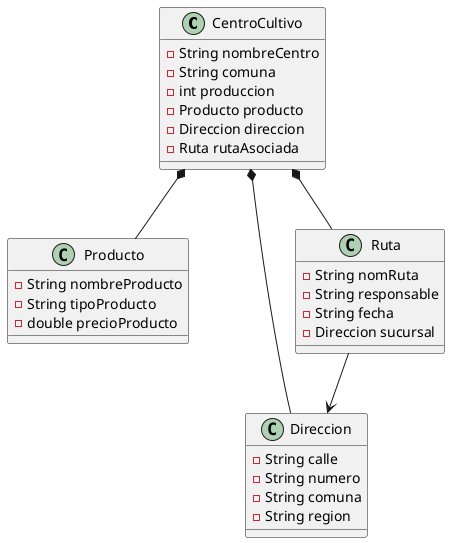

<p>
  
</p>

# 🐟 SalmonttApp  
### Sistema de Gestión de Centros de Cultivo - Maven + Java + POO  
**Autor:** Víctor Valenzuela  
**Institución:** Duoc UC  
**Asignatura:** Fundamentos de Programación / POO  
**Evaluación Semana 5 – Proyecto Sumativo**

---

## 📌 **Descripción del Proyecto**

**SalmonttApp** es una aplicación desarrollada en Java orientada a objetos que permite administrar centros de cultivo salmonícolas.  
El sistema carga datos desde archivos **TXT** y **CSV**, genera estructuras de objetos relacionadas mediante **composición** y permite realizar:

- Listado completo de centros
- Búsqueda por comuna
- Filtros por producción
- Ordenamiento alfabético
- Impresión tabular profesional
- Uso de clases compuestas:  
  **CentroCultivo → Producto → Dirección → Ruta**

Además, el proyecto está configurado con **Maven** y puede generar un **.jar ejecutable**.

---

## 🎯 **Objetivos de la Evaluación**

✔ Aplicar Programación Orientada a Objetos  
✔ Uso de clases compuestas  
✔ Lectura desde archivos externos  
✔ Manejo de colecciones  
✔ Uso de Stream API (búsqueda, filtros, ordenamiento)  
✔ Arquitectura por capas  
✔ Javadoc en todas las clases  
✔ README profesional  
✔ Generación y ejecución de un `.jar`  
✔ Implementación completa para demostración en video  

---

## 📦 **Arquitectura del Proyecto**

El proyecto sigue una estructura profesional basada en paquetes:
```
src/main/java/
└── com.salmonttcorp
├── app
│ └── Main.java
├── model
│ ├── CentroCultivo.java
│ ├── Producto.java
│ ├── Direccion.java
│ └── Ruta.java
├── service
│ └── CentroService.java
└── util
└── GestorDatos.java

src/main/resources/
├── datosCentros.txt
└── datosCentros.csv
```
---

### 🧩 **Descripción de los paquetes**

| Paquete | Rol |
|--------|-----|
| **app** | Contiene la clase principal `Main` (punto de entrada) |
| **model** | Modelo del dominio con relaciones por composición |
| **service** | Lógica de negocio: filtros, búsquedas, ordenamiento |
| **util** | Carga de archivos TXT/CSV y construcción del modelo |
| **resources** | Archivos de datos externos |

---

## 🧬 **Composición del Modelo**

La aplicación utiliza **composición** para estructurar su dominio:
```
CentroCultivo
├── Producto
├── Direccion
└── Ruta
```


Cada clase contiene Javadoc completo y validaciones.

---

## 🗂️ **Diagrama UML del Sistema (PlantUML)**



---
📄 Archivos de Datos
datosCentros.csv (12 columnas – formato extendido)
```
nombreCentro;comuna;produccion;nombreProducto;tipoProducto;precioProducto;calle;numero;region;nomRuta;responsable;fecha
Isla Huar;Calbuco;1200;Salmón Atlántico Premium;Ahumado;8500;Costanera;1240;Los Lagos;Ruta inspección Calbuco;Supervisor Turno A;2025-01-20
Chacao Norte;Ancud;980;Trucha Arcoíris;Fresco;6900;Av. Pacifico;552;Los Lagos;Ruta revisión Ancud;Jefe Planta;2025-01-22
```
---
🧠 Funciones Implementadas (Service Layer)
🔍 Búsqueda por comuna
```
service.buscarPorComuna("Calbuco");
```
📊 Filtrar por producción mínima
```
service.filtrarPorProduccionMinima(1500);

```
🔠 Ordenar alfabéticamente
```
service.ordenarPorNombre();

```
📋 Listar completa
```
service.listarTodos();

```
---
## 🖥️ Salida de Consola Esperada

Incluye 4 tablas:
* Lista completa
* Búsqueda por comuna
* Filtro por producción
* Ordenamiento
* Tabla final de COMPOSICIÓN COMPLETA

Ejemplo:
```
CENTRO               | COMUNA     | PRODUCCIÓN | PRODUCTO                    | TIPO         | PRECIO
----------------------------------------------------------------------------------------------------
Isla Huar            | Calbuco    | 1200       | Salmón Atlántico Premium    | Ahumado      | 8500.0
...

```
Tabla final:
```
CENTRO        | PRODUCTO                  | DIRECCIÓN                             | RUTA                    | FECHA
-----------------------------------------------------------------------------------------------------------------------
Isla Huar     | Salmón Atlántico Premium  | Costanera 1240, Calbuco, Los Lagos    | Ruta inspección Calbuco | 2025-01-20

```
---
## 🚀 Compilación y Generación del JAR
1️⃣ Compilar:
```
mvn clean package

```
2️⃣ Ubicación del JAR:
```
target/SalmonttApp_Maven-1.0-SNAPSHOT.jar

```
3️⃣ Ejecutar:
```
java -jar target/SalmonttApp_Maven-1.0-SNAPSHOT.jar

```


## 👨‍💻 Autor

Víctor Valenzuela Concha  
Estudiante – analista Programador Computacional.  
Duoc UC – DOO

